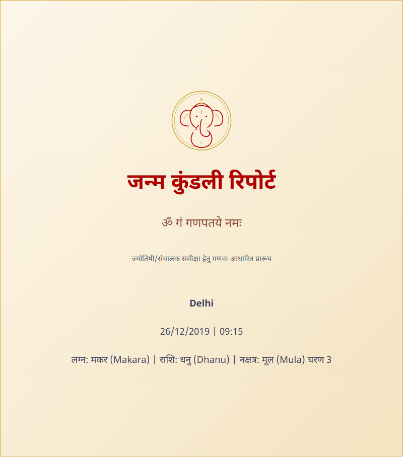
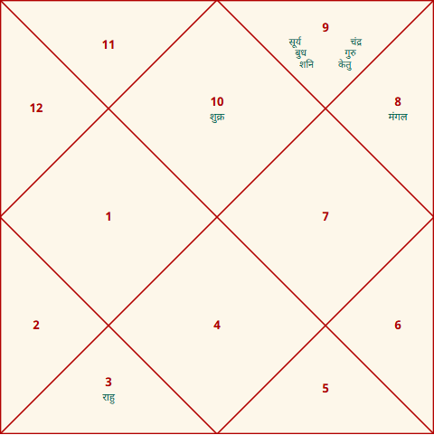
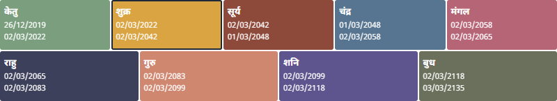

# Astro Skill

[](https://github.com/adityarya24/astro-skill/actions/workflows/ci.yml)

Portable Vedic astrology engine, agent skill, and MCP server. Deterministic
kundali, dasha, panchang, and yoga calculations with JSON and Hindi/English PDF
reports — reusable by any agent or MCP-compatible client.

<p align="center">
  
  
</p>
<p align="center">
  
</p>

The repo is split so each layer can be reused on its own:

- **`astro/`** — the portable skill: calculator scripts, reference data, bundled
  Swiss Ephemeris + Devanagari font, and tests. Drop it into any agent or call
  the scripts directly from Python.
- **`services/astro_mcp/`** — a generic stdio MCP server exposing the same
  calculations plus SQLite storage as 11 stable tools.
- **`apps/`** — optional products built on top (e.g. a web panel scaffold).
- **`docs/`** — architecture, roadmap, deployment, and operations docs.

## Features

- **Kundali** — lagna, rashi, nakshatra + pada, nine grahas (with retrograde),
  whole-sign houses, and dosha flags (e.g. Mangalik).
- **Navamsa (D9)** divisional chart in both JSON and the PDF report.
- **Vimshottari dasha** — mahadasha + antardasha timeline with correct
  birth-balance handling (the sub-period actually running at birth, not a fresh
  lord/lord cycle).
- **Daily Panchang** — tithi, vara, nakshatra, yoga, karana, sunrise/sunset —
  anchored at sunrise (classical convention), with muhurta and yoga detection.
- **Lahiri (Chitrapaksha) sidereal** positions, whole-sign houses.
- **High precision** — bundled Swiss Ephemeris `.se1` data (SWIEPH) with an
  automatic Moshier fallback; each output records the tier used in
  `calculation.ephemeris`.
- **Reports** — structured JSON, and PDF via a preferred HTML/Chromium renderer
  (polished Devanagari) or a legacy in-process ReportLab fallback. Hindi/English,
  with a bundled Noto Sans Devanagari font. The HTML renderer also supports a
  `pandit_v1` premium template for pitch-ready operator reports.
- **MCP server** — 11 tools over stdio, with SQLite-backed client/report storage,
  input validation, and traversal-safe report filenames.

## Quick start

```bash
git clone https://github.com/adityarya24/astro-skill.git
cd astro-skill
python -m venv .venv && . .venv/bin/activate    # Windows: .\.venv\Scripts\Activate.ps1
python -m pip install --upgrade pip
pip install -e ".[dev]"

# Optional: Chromium for the preferred HTML PDF renderer
python -m playwright install chromium

# Checks
python -m pytest -q
python -m ruff check astro services scripts
```

All tests pass; the HTML/Chromium PDF render test skips automatically until
Chromium is installed. For OS-specific venv details and MCP client config
examples, see [`docs/operations/install-smoke.md`](docs/operations/install-smoke.md).

## MCP server

`services/astro_mcp/` is an importable package and a runnable **stdio MCP
server**. The same `TOOLS` registry powers the unit tests and the wire protocol
— no duplicated logic, and no environment variables required.

Tools (11): `parse_birth_details`, `save_client_profile`, `find_client_profile`,
`list_client_reports`, `calculate_kundali`, `calculate_dasha`,
`calculate_gochar`, `calculate_compatibility`, `calculate_panchang`,
`generate_report_json`, `generate_pdf_report`.

```bash
python -m services.astro_mcp        # or `astro-mcp` after `pip install -e .`
```

Wire it into any MCP client (Claude Desktop, a Codex agent, or your own) by
pointing the client's MCP config at that command with `cwd` set to the repo
root. See [`services/astro_mcp/README.md`](services/astro_mcp/README.md) for the
tool contract and config examples, and verify an install in one shot with:

```bash
python scripts/smoke_mcp_client.py
```

## Sample commands

```bash
# Kundali JSON
python astro/scripts/kundali_calculator.py --dob 26/12/2019 --tob 09:15 \
  --place Delhi --lat 28.6139 --lon 77.2090 --timezone Asia/Kolkata --json

# Panchang JSON
python astro/scripts/panchang_calculator.py --date 2026-05-21 \
  --place Delhi --lat 28.6139 --lon 77.209 --timezone Asia/Kolkata --json

# Hindi PDF (default HTML/Chromium renderer; add --renderer reportlab for the
# no-browser fallback)
python astro/scripts/pdf_report.py --kundali-json chart.json --dasha-json dasha.json \
  --panchang-json panchang.json --output report.pdf --language hi

# Pandit-style report
python astro/scripts/pdf_report.py --kundali-json chart.json --dasha-json dasha.json \
  --panchang-json panchang.json --output pandit-v1.pdf --language hi \
  --template pandit_v1 --client-name "Client Name"
```

## Deployment

Run it as a Docker MCP server (the image bundles Python, dependencies, Chromium,
the Devanagari font, and the ephemeris data) or straight from Python. See
[`docs/deploy.md`](docs/deploy.md) for build, run, smoke-test, and MCP-client
wiring instructions.

## Documentation

- [`docs/operations/install-smoke.md`](docs/operations/install-smoke.md) — fresh-clone install, MCP client config, smoke checklist.
- [`docs/deploy.md`](docs/deploy.md) — Docker / MCP-client deployment.
- [`docs/architecture/generic-astro-platform.md`](docs/architecture/generic-astro-platform.md) — layering and reuse model.
- [`docs/architecture/astro-skill-roadmap.md`](docs/architecture/astro-skill-roadmap.md) — engine roadmap.
- [`services/astro_mcp/README.md`](services/astro_mcp/README.md) — MCP server contract.
- [`astro/SKILL.md`](astro/SKILL.md) — agent skill instructions.

## Production notes

- Positions use the bundled high-precision Swiss Ephemeris (SWIEPH) out of the
  box, not the lower-precision Moshier fallback.
- The default PDF path is HTML/Chromium for production Hindi rendering; ReportLab
  stays as a no-browser fallback.
- Generated runtime data lives under an ignored `data/` directory (or a
  caller-provided output directory).
- MCP tools validate their JSON schemas and keep generated filenames detached
  from caller-controlled identifiers.
- GitHub Actions runs install, Chromium setup, tests, ruff, and skill validation
  on push and pull requests.

## Safety boundaries

These rules apply across every layer and downstream product:

- Reports are calculation-backed drafts, intended for review by an astrologer or
  operator before any final reading is shared.
- Missing birth details must be requested rather than guessed.
- Approximate or partial inputs must be marked clearly in any output.
- Do not generate death, accident, medical, or unavoidable-harm certainty
  predictions.

## License

MIT — see [LICENSE](LICENSE).
